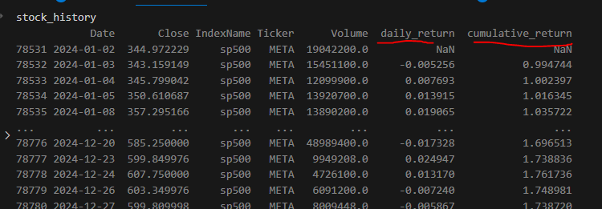
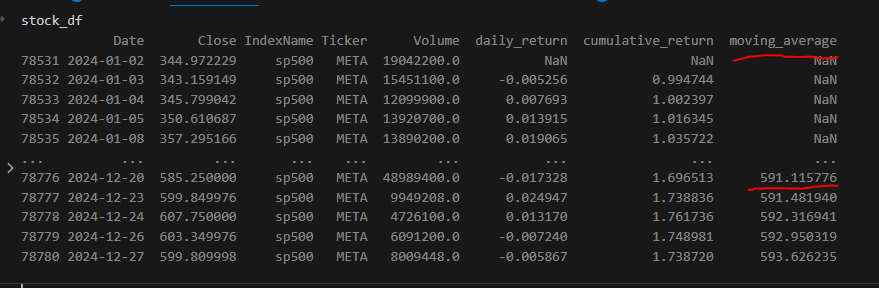
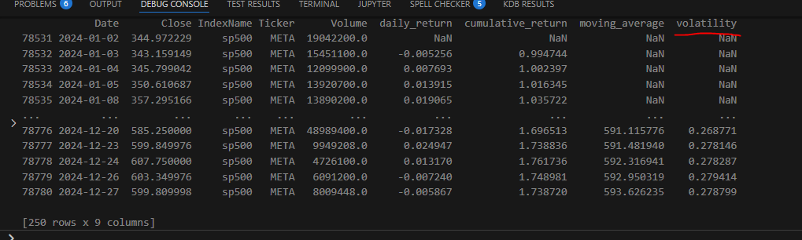

# TASKS.md

This file outlines the tasks for your finance ETL and analysis project. Each task includes relevant functions (based on your existing code) and instructions on their usage. Follow them in order to implement a typical data workflow: get data → clean data → enrich data → visualization → create charts → report generation.

---

### Lesson 1 录屏:[Google drive 链接](https://drive.google.com/drive/folders/1iU_gEgyRuALyBOeynR6HDsr5lbL9nP69?usp=sharing)

## Task 1: Get Data

### Functions

1. **`get_stock_data(stock_name: str, start_date: str, end_date: str) -> pd.DataFrame`**

   - Located in: `read_data.py`
   - Loads CSV data from the `stock_data.csv` file.
   - Filters rows matching the given `stock_name` (case-insensitive) and the date range between `start_date` and `end_date`.
   - Returns a Pandas DataFrame with the filtered results.

2. **`get_sector_data() -> pd.DataFrame`**
   - Located in: `read_data.py`
   - Loads sector and industry information from `sector_info.csv`.
   - Returns a DataFrame with columns such as `Ticker`, `Sector`, and `Industry`.

### Instructions

- Implement or review the logic in `get_stock_data` to verify it correctly filters the CSV by `stock_name` and date range.
- Verify that `get_sector_data` properly reads from your sector CSV file (e.g., `sector_info.csv`).

### Expected Output

- A DataFrame with valid stock data (filtered by date range and stock name).
- A DataFrame containing sector/industry mappings.

---

### Lesson 2 预习资料

1. what is virtual environment and how to create it: [小红书链接](http://xhslink.com/a/fcm1rJhRcPtdb)
2. how to debug in vs code: [小红书链接](http://xhslink.com/a/LlaEZ4NxRPtdb)

## Task 2: Enrich Data

create a python file called transform.py and put following python functions into it

1. create `add_stock_returns(df: pd.DataFrame) -> pd.DataFrame` function so it takes the data loaded from get_stock_data above and add daily_return column and cumulative_return column



2. create `calculate_moving_average(df: pd.DataFrame, window: int) -> pd.DataFrame` function so it calculate the moving average of stock close price based on the window parameter



3. create `add_stock_volatility(df: pd.DataFrame, window: int) -> pd.DataFrame` function it uses the daily return calculated in step 1 to calculate stock volatility column based on the window input



### Instructions

- **`add_stock_returns`**:
  a. "daily_return": this is calculated using the "close" price column, google "how to calcualte daily return pandas"
  b. "cummulative_return": this is caculated using the "daily_return" caculated from step above(see stackoverflow below)
  https://stackoverflow.com/questions/35365545/calculating-cumulative-returns-with-pandas-dataframe

- **`calculate_moving_average`**: Add a specified moving-average column (e.g., 30-day MA).
- **`add_stock_volatility`**: Compute rolling standard deviation based on daily returns over a chosen window (e.g., 30 days).

## Task 4: Compute Monthly Stats

### Relevant Functions

4. `enrich_with_sector_industry(df: pd.DataFrame) -> pd.DataFrame`

- **`enrich_with_sector_industry`**: Merge data from `get_sector_data()` into your DataFrame to add sector and industry columns.

_(Potentially from `transform_data.py`)_

1. `calculate_monthly_returns(df: pd.DataFrame) -> pd.DataFrame`
2. `calculate_stats(df: pd.DataFrame) -> pd.DataFrame`

### Instructions

- **`calculate_monthly_returns`**: Group data by month (using the Date column) and compute monthly returns using month-end prices or aggregated returns.
- **`calculate_stats`**: Produce summary statistics such as mean returns, max returns, min returns, or overall volatility.

### Expected Output

- A monthly returns DataFrame with columns like `Month`, `Monthly Return`.
- A stats DataFrame (or dictionary) with key indicators for the stock.

---

## Task 5: Visualization (Create Charts)

_(No specific standalone function for chart creation is currently visible in your codebase—likely these steps occur inside `generate_stock_analysis_html`.)_

- You may create separate functions for plotting, or embed them directly in the HTML generation step.
- Typical charts include:
  1. Stock price trend
  2. Daily/monthly returns
  3. Volatility
  4. (Optional) Heatmap of daily returns

### Expected Output

- Plotly figures or other visual outputs representing the stock's performance.

---

## Task 6: Generate HTML Report

### Function

1. **`generate_stock_analysis_html(stock_history: pd.DataFrame, monthly_returns: pd.DataFrame, stats: dict, output_file: str) -> None`**
   - Located in: `visualization.py`
   - Combines charts (price, returns, volatility) and tables (monthly returns, statistics) into an HTML file.

### Instructions

- Pass in your full DataFrame (`stock_history`), the monthly returns DataFrame, and the stats dictionary.
- Embed your charts (e.g., from Plotly) in a user-friendly HTML report.

### Expected Output

- An HTML file (e.g., `AAPL_stock_analysis.html`) containing:
  1. Graphs of stock prices, volatility, etc.
  2. A table of monthly returns.
  3. Summary statistics.

---

## Putting It All Together

After completing the above tasks, you will have:

1. A pipeline that reads raw CSV data (Tasks 1 & 2).
2. Enriched & transformed data sets with additional insights (Tasks 3 & 4).
3. Visual charts and an automated HTML report (Tasks 5 & 6).

Use your `main.py` script to stitch everything together in a logical sequence:

1. **Retrieve data** (Task 1).
2. **Clean data** if needed (Task 2).
3. **Enrich data** with returns, volatility, and sector info (Task 3).
4. **Compute monthly returns** and overall stats (Task 4).
5. **Create charts** and **generate** an HTML report (Tasks 5 & 6).

---

Task 1 Solution
copy model.py in this folder to your project

```Python
from pathlib import Path
import pandas as pd
from model import StockPrice, EnrichmentColumns
PROJECT_FOLDER = Path(__file__).parent
DATA_FOLDER = PROJECT_FOLDER.joinpath('data')


#Task 1: Read the stock data from a CSV file and filter it by stock name(make sure stock name is insensitive) and date range.
# The function get_stock_data takes a stock name, start date, and end date as input parameters.
# It reads the stock data from a CSV file, filters it by the specified stock name and date range,
# and returns the filtered data as a pandas DataFrame.
def get_stock_data(stock_name: str, start_date:str, end_date:str) -> pd.DataFrame:
    """
    Retrieves stock data for a specific stock within a given date range.

    This function reads stock data from a CSV file, filters it by the specified stock name
    and date range, and returns the filtered data as a pandas DataFrame.

    Args:
        stock_name (str): The name of the stock to filter.
        start_date (str): The start date of the range in 'YYYY-MM-DD' format.
        end_date (str): The end date of the range in 'YYYY-MM-DD' format.

    Returns:
        pd.DataFrame: A DataFrame containing the filtered stock data with columns such as
                      'Date', 'Stock', and other stock-related metrics.

    """
    stock_data_path = DATA_FOLDER.joinpath('stock_data.csv')
    df = pd.read_csv(stock_data_path)
    df[StockPrice.DATE] = pd.to_datetime(df[StockPrice.DATE])
    mask = (df[StockPrice.DATE] >= start_date) & (df[StockPrice.DATE] <= end_date) & (df[StockPrice.TICKER].str.lower() == stock_name.lower())
    filtered_df = df.loc[mask]

    return filtered_df


def get_sector_data() -> pd.DataFrame:
    """
    Retrieves sector data from a CSV file.

    This function reads sector data from a CSV file and returns it as a pandas DataFrame.

    Returns:
        pd.DataFrame: A DataFrame containing the sector data with columns such as
                      'Ticker', 'Sector', and 'Industry'.

    """
    sector_data_path = DATA_FOLDER.joinpath('sector_info.csv')
    df = pd.read_csv(sector_data_path)
    return df
```

Task 2 Solution

```Python
def add_stock_returns(stock_history:pd.DataFrame) -> pd.DataFrame:
"""
add stock returns to the stock history DataFrame.
This function calculates daily and cumulative returns for the stock data.

    Arguments:
        stock_history: Pandas DataFrame with historical stock data.

    Return:
        Enriched Pandas DataFrame.
    """
    stock_history = stock_history.sort_values(by=StockPrice.DATE)
    stock_history[EnrichmentColumns.DAILY_RETURN] = stock_history[StockPrice.CLOSE].pct_change()
    stock_history[EnrichmentColumns.CUMULATIVE_RETURN] = (1 + stock_history[EnrichmentColumns.DAILY_RETURN]).cumprod()-1
    return stock_history

def add_stock_volatility(stock_history: pd.DataFrame, window:int = 30) -> pd.DataFrame:
"""
Adds stock volatility to the stock history DataFrame.

    This function calculates the rolling standard deviation of daily returns over a specified window.

    Arguments:
        stock_history: Pandas DataFrame with historical stock data.

    Return:
        Enriched Pandas DataFrame.
    """
    stock_history = stock_history.sort_values(by=StockPrice.DATE)
    stock_history[EnrichmentColumns.VOLATILITY] = stock_history[EnrichmentColumns.DAILY_RETURN].rolling(window=window).std()*np.sqrt(252)
    return stock_history

def calculate_moving_average(stock_history: pd.DataFrame, window: int = 5

) -> pd.DataFrame:
"""
Calculate the moving average for the stock history DataFrame.

    This function computes the moving average of the closing stock prices
    over a specified window and adds it as a new column to the DataFrame.

    """
    stock_history = stock_history.sort_values(by=StockPrice.DATE)
    stock_history[EnrichmentColumns.MOVING_AVERAGE] = stock_history[StockPrice.CLOSE].rolling(window=window).mean()
    return stock_history

```
